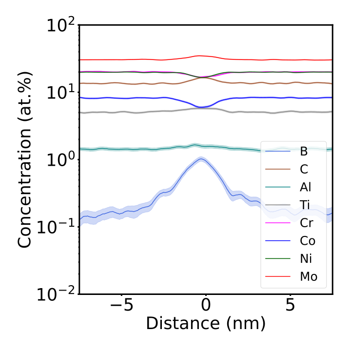

# Interfacial excess caluclation across phase boundaries from atom probe data
## Overview
These methods allow the calculation of the interfacial excess across phase boundaries in proximity to grain boundaries. I have provided a few example datasets and exported data from the paper cited below. Please feel free to use these functions and reference them appropriately, thank you.  

## Calculations
The first step is obtaining high-quality proximity histograms (proxigrams) from your atom probe reconstruction. I found a step size of 0.05 nm and width +- 15 nm works very well. However, large and more diffuse interfaces may require adjustments, but you will always need to keep the step size reasonably fine.
From the proxigrams, the script automatically calculates concentration difference profiles: Step-wise difference in concentration over the step-wise difference in its spatial coordinate x. If both are present, the global maximum and minimum are used to determine the interface location. In some instances, only maxima and minima are present, and you may need to make minor manual adjustments to the interface location.
Next, cumulative profiles (or ladder diagrams) are calculated from the summation of solute atom counts over the summation of all atom counts. The interface location spatial coordinate is placed to its corresponding coordinate in the cumulative profile. The solute excess is determined via extrapolation towards this interface location. The detailed equations and error estimations are accessible in the paper below.

## Example data

## Input & export

## Citing
Please cite this paper when using this code: https://doi.org/10.1016/j.ultramic.2023.113885

## Acknowledgements
This research is funded via the Australian Research Council projects (LP180100144, LP190101169, and DP230101063). Special acknowledgements are given to Michael Lison-Pick and Dr. Steven Street for providing the materials used in this study. The authors thank Drs Charlie Kong and Richard Webster for technical assistance and use of facilities supported by Microscopy Australia at the Electron Microscope Unit at the Mark Wainwright Centre of Microscopy and Microanalysis at UNSW. The authors also thank Dr Takanori Sato and the Australian Centre of Microscopy and Microanalysis at the University of Sydney. Fruitful discussions with Prof. Peter Felfer (FAU Erlangen), Dr. Nima Haghdadi (UNSW Sydney), Dr Daniel Scheiber (Montanuniversität Leoben) and Mr. Han Lin Mai (The University of Sydney) are also acknowledged.
