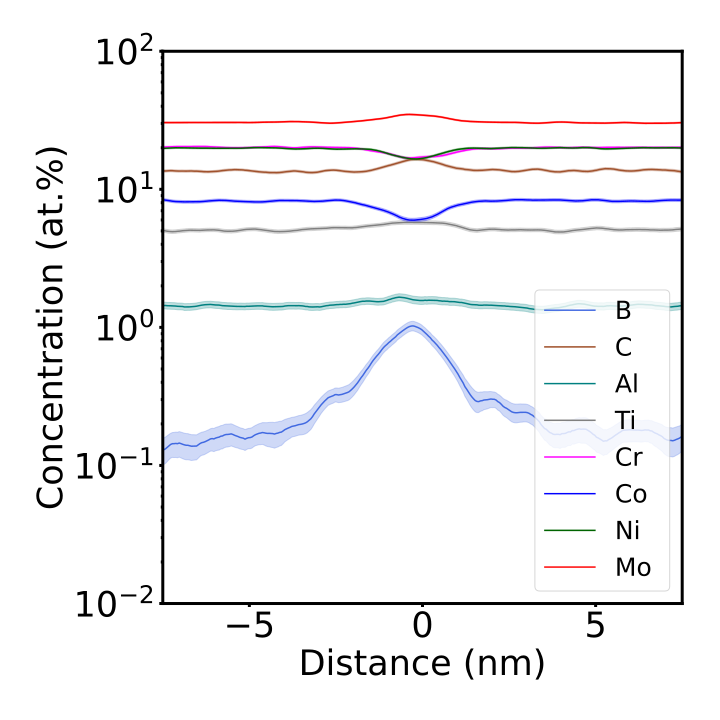
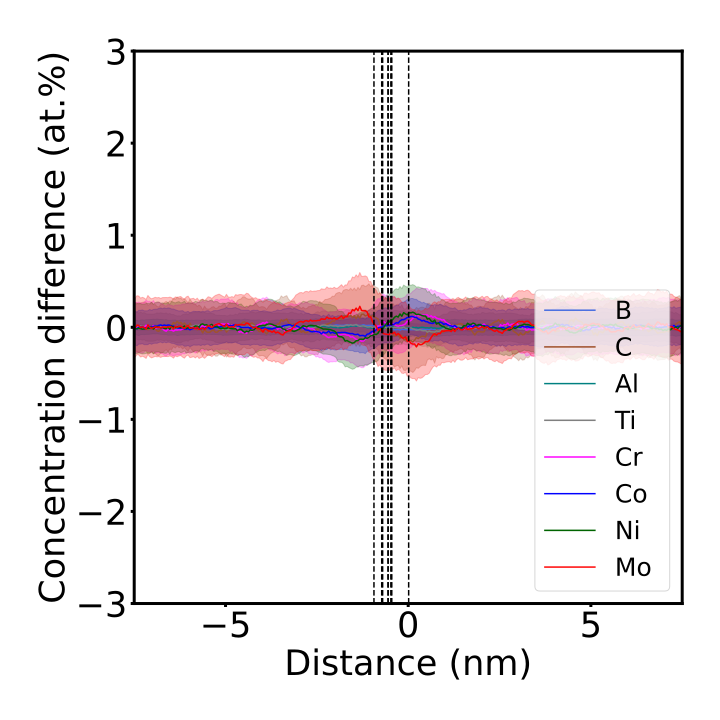
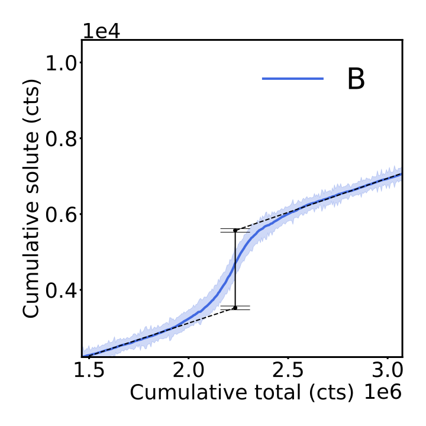
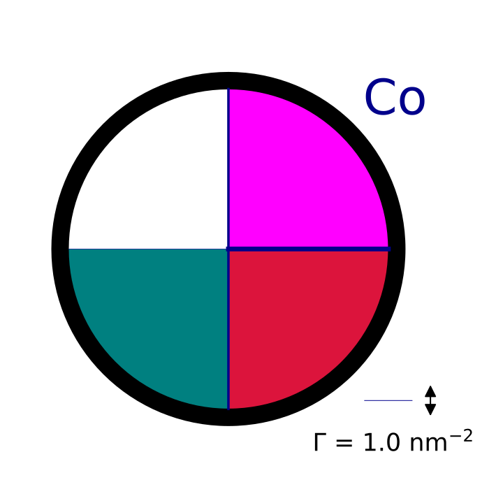

# Solute excess tool across from atom probe data
## Overview
This tool supports solute excess quantification across interfaces and around dislocations using APT data. 1D concentration profiles or proximity histograms may be used as input. I have provided an example dataset in addition to the old data from the interfacial excess paper. Please use these functions and reference them appropriately, thank you. 

## Updates
I have rewritten most functions of the original script to help with ease of use, improve adaptation to different workflows, and fixed some errors.
- Biggest update: The tool now has a GUI based on Toga (https://toga.beeware.org/en/stable/), which should agnostic to using a Windows PC, Linux, or Mac.
- Improvements: Background calculations now mostly rely on Pandas data frames (https://pandas.pydata.org/) so calculations are a bit 'cleaner'. 
- Fixes: The old script applied smoothing to concentration, then again to concentration difference. Not a big problem, but not what it was intended to do.
- Regression: I am still working on incorporating the error estimations, please stay up to date for that! 

(Note to myself, updating readme from here and below...)

## Calculations
The first step is obtaining high-quality proximity histograms (proxigrams) from your atom probe reconstruction. I found a step size of 0.05 nm and width +- 15 nm works very well. However, large and more diffuse interfaces may require adjustments, but you will always need to keep the step size reasonably fine.
From the proxigrams, the script automatically calculates concentration difference profiles: Step-wise difference in concentration over the step-wise difference in its spatial coordinate x. If both are present, the global maximum and minimum are used to determine the interface location. In some instances, only maxima and minima are present, and you may need to make minor manual adjustments to the interface location.
Next, cumulative profiles (or ladder diagrams) are calculated from the summation of solute atom counts over the summation of all atom counts. The interface location spatial coordinate is placed to its corresponding coordinate in the cumulative profile. The solute excess is determined via extrapolation towards this interface location. The detailed equations and error estimations are accessible in the paper below.

## Example data
Here is a proximity histogram across a M6C / M6C interface. The enrichment and depletion of different elements are obvious.

This is an example of a concentration difference profile, corresponding to the proximity histogram above. The M6C / M6C interface exhibits the strongest variation for all elements. Black dashed lines mark the interface location identified from each element. Their consistent location allows to calculate the average from all elements.

Here is an exemplary cumulative profile of the above proximity histogram and concentration difference profiles. The solute excess is calculated via extra polation to the interface location. Error estimations are indicated in the upper and lower range providing the standard deviation of the solute excess. The interface location is required to then calculate the interfacial excess.

Finally, the interfacial excess across different interfaces can be summarised in this 'interface plot'. The line width corresponds to the interfacial excess. Colored lines indicate enrichment, black lines indicate depletion. 

## Input & export
Input:
- Proximity histogram csv data
- Interface area
- Elements of interests

Output:
- Plotted proximity histogram
- Concentration difference profile
- Cumulative profiles
- Interfacial excess and standard deviation
- Interface plot if desired

## Citing
Please cite this paper when using this code: https://doi.org/10.1016/j.ultramic.2023.113885

## Acknowledgements
This research is funded via the Australian Research Council projects (LP180100144, LP190101169, and DP230101063). Special acknowledgements are given to Michael Lison-Pick and Dr. Steven Street for providing the materials used in this study. The authors thank Drs Charlie Kong and Richard Webster for technical assistance and use of facilities supported by Microscopy Australia at the Electron Microscope Unit at the Mark Wainwright Centre of Microscopy and Microanalysis at UNSW. The authors also thank Dr Takanori Sato and the Australian Centre of Microscopy and Microanalysis at the University of Sydney. Fruitful discussions with Prof. Peter Felfer (FAU Erlangen), Dr. Nima Haghdadi (UNSW Sydney), Dr Daniel Scheiber (Montanuniversität Leoben) and Mr. Han Lin Mai (The University of Sydney) are also acknowledged.
